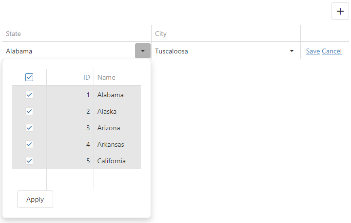

<!-- default badges list -->

<!-- default badges end -->
# DataGrid for DevExtreme - How to implement cascading DropDownBoxes

This example demonstrates how to implement cascading DropDownBoxes. The main idea is to get the changed value from the first editor and filter the data source in the second editor so that it shows relevant items.

## Files to Review

- **jQuery**
    - [index.html](jQuery/index.html)
- **Angular**
    - [app.component.html](Angular/src/app/app.component.html)
    - [app.component.ts](Angular/src/app/app.component.ts)
- **Vue**
    - [App.vue](Vue/src/App.vue)
- **React**
    - [App.js](React/src/App.js)
- **ASP.Net**    
    - [Index.cshtml](ASP.NET/DevExtremeAspNetCoreApp1/Views/Home/Index.cshtml)
    
## Documentation

- [Getting Started with DataGrid](https://js.devexpress.com/Documentation/Guide/UI_Components/DataGrid/Getting_Started_with_DataGrid/)

- [DataGrid - API Reference](https://js.devexpress.com/Documentation/ApiReference/UI_Components/dxDataGrid/)
<!-- feedback -->
## Does this example address your development requirements/objectives?

 

(you will be redirected to DevExpress.com to submit your response)
<!-- feedback end -->
